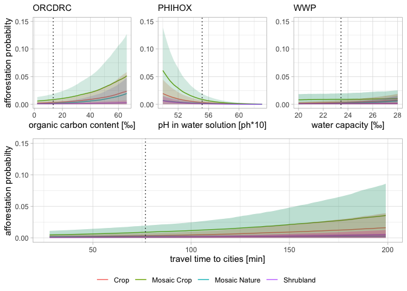

Bayesian modeling of oil palm expansion in Santander, Colombia - results
================
Marius Derenthal

# introduction

This document shows the results for the “Bayesian modeling of oil palm
expansion in Santander, Colombia” analysis.

Inspired, and partly duplicated, from A. Solomon Kurz, Paul Bürkner, and
Richard McElreath.

# workflow

1.  load data
2.  data processing
3.  modeling
4.  model comparison

# setup

## packages

``` r
pacman::p_load(vroom, here, tidyverse, hrbrthemes, viridis, corrplot, GGally, 
               brms, tidybayes, modelr, bayesplot, rstanarm, loo, projpred, 
               caret, splines, broom.mixed, ROCR, sjstats,HSAUR3, flextable,
               wesanderson, ggthemes, splitstackshape, patchwork, PNWColors, 
               ggExtra, tseries, gmp, geosphere, survival, shinystan, sjmisc, 
               sjstats, sjPlot, bayestestR, see, glmmTMB, ggcorrplot, 
               BayesPostEst, ggpubr, brmstools, gridExtra)
```

# analysis

## 1. load data

``` r
base_raw_model  <- readRDS(here("models/02_model_output/base_raw_model.rds")) 
base_model  <- readRDS(here("models/02_model_output/base_model.rds")) 
base_model_no_group  <- readRDS(here("models/02_model_output/base_model_no_group.rds")) 
base_slim_model  <- readRDS(here("models/02_model_output/base_slim_model.rds")) 
ris_slim_model  <- readRDS(here("models/02_model_output/ris_slim_model.rds")) 

data_samp_samp = readRDS(here('data/03_processed/sample_models/data_model_samp'))
data <- vroom(here("data/03_processed/sample_points/sample_points_0311.csv"))
```

## 2. data processing

``` r
# remove all class == 50 as we are not interested in forest class as predictor
data<-data[!(data$class==50),]
# remove all year == 2003 as we do not have dist_afforastation in that year
data<-data[!(data$year==2003),]
# remove all year == 2015 as no afforestation is taking place in 14/15 (NAs)
data<-data[!(data$year==2015),]
# remove all year == 2019 as it is the last year and we do not have data for 2020
data<-data[!(data$year==2019),]
# remove all neigh_tot <=4 as we want points with at least 5 neighbouring cells
#data<-data[!(data$neigh_tot<=4),]

sum(data$afforestation)/nrow(data)
```

    ## [1] 0.0274395

``` r
# remove uncessary columns
data <- data[, !(colnames(data) %in% c("...1", "count", "count_forest"))]


# remove rows with incompltete soil features
data<-data[!(data$AWcTS==255),]
data<-data[!(data$WWP==255),]
data<-data[!(data$PHIHOX==0),]
data<-data[!(data$ORCDRC==0),]
# data types
# categorical values
data$MPIO_CNM_1 <- as.factor(data$MPIO_CNM_1)
levels(data$MPIO_CNM_1)[levels(data$MPIO_CNM_1) == "Barrancabermeja"] <- 1
levels(data$MPIO_CNM_1)[levels(data$MPIO_CNM_1) == "Puerto Wilches"] <- 2
levels(data$MPIO_CNM_1)[levels(data$MPIO_CNM_1) == "Sabana De Torres"] <- 3
data$class <- as.factor(data$class)
#data$afforestation <- as.factor(data$afforestation)
data$year <- as.factor(data$year)
data$plot_id <- as.factor(data$plot_id)

data$Oferta_Amb <- as.factor(data$Oferta_Amb)
levels(data$Oferta_Amb)[levels(data$Oferta_Amb) == "Áreas Para Producción"] <- 1
levels(data$Oferta_Amb)[levels(data$Oferta_Amb) == "Áreas Prioritarias para la Conservación"] <- 2
levels(data$Oferta_Amb)[levels(data$Oferta_Amb) == "Zonas urbanas"] <- 3
levels(data$Oferta_Amb)[levels(data$Oferta_Amb) == "Áreas de Protección Legal"] <- 4
```

## 2. correlation

``` r
base_raw_model_cor = cor(base_raw_model$data[, unlist(lapply(base_raw_model$data, is.numeric))])
colnames(base_raw_model_cor) <- c("afforestation", 
                                   "altitude", "slope", "aspect",
                                   "ORCDRC", "AWcTS", "PHIHOX", "WWP",
                                   "distance population", "distance mill", 
                                   "distance road", "distance afforesation",
                                   "distance river")
rownames(base_raw_model_cor) <- c("afforestation", 
                                   "altitude", "slope", "aspect",
                                   "ORCDRC", "AWcTS", "PHIHOX", "WWP",
                                   "distance population", "distance mill", 
                                   "distance road", "distance afforesation",
                                   "distance river")

corrplot(base_raw_model_cor)
```

<!-- -->

## 3. convergence

``` r
mcmc_plot(ris_slim_model, type = "trace",regex_pars = c("^b_"), facet_args = list(nrow = 2))
```

<!-- -->

``` r
#mcmc_plot(ris_slim_model, type = "trace",regex_pars = c("^sd_"), facet_args = list(nrow = 2))
#mcmc_plot(ris_model, type = "trace")

mcmc_plot(ris_slim_model, type = "rhat")
```

<!-- -->

``` r
mcmc_plot(ris_slim_model, type = "acf_bar",regex_pars = c("^b_"))
```

<!-- -->

``` r
#mcmc_plot(ris_slim_model, type = "acf_bar",regex_pars = c("^sd_"))
```

## 4. assessing fit

``` r
pp_check(ris_slim_model, nsamples = 100, type = "dens_overlay")
```

<!-- -->

``` r
proportion_affo <- function(x){mean(x == 1)}
pp_check(ris_slim_model, nreps = 100,
         plotfun = "stat", stat = "proportion_affo", type = "hist" ) + 
  xlab("probability of affo")
```

<!-- -->

## 5. population effects estimates

### 5.1 basic tables

``` r
summary(base_model)
```

    ##  Family: bernoulli 
    ##   Links: mu = logit 
    ## Formula: afforestation ~ slope_z + aspect_z + ORCDRC_z + PHIHOX_z + WWP_z + dist_pop_z + dist_po_mill_z + dist_road_z + dist_afforestation_z + (1 | class) + (1 | MPIO_CNM_1) + (1 | year) + (1 | Oferta_Amb) 
    ##    Data: data_samp_samp (Number of observations: 7601) 
    ## Samples: 4 chains, each with iter = 2000; warmup = 1000; thin = 1;
    ##          total post-warmup samples = 4000
    ## 
    ## Group-Level Effects: 
    ## ~class (Number of levels: 4) 
    ##               Estimate Est.Error l-95% CI u-95% CI Rhat Bulk_ESS Tail_ESS
    ## sd(Intercept)     2.09      1.64     0.38     5.70 1.02      305     1660
    ## 
    ## ~MPIO_CNM_1 (Number of levels: 3) 
    ##               Estimate Est.Error l-95% CI u-95% CI Rhat Bulk_ESS Tail_ESS
    ## sd(Intercept)     1.18      1.49     0.01     4.95 1.01      323      958
    ## 
    ## ~Oferta_Amb (Number of levels: 3) 
    ##               Estimate Est.Error l-95% CI u-95% CI Rhat Bulk_ESS Tail_ESS
    ## sd(Intercept)     1.54      1.67     0.01     5.28 1.01      243     1411
    ## 
    ## ~year (Number of levels: 14) 
    ##               Estimate Est.Error l-95% CI u-95% CI Rhat Bulk_ESS Tail_ESS
    ## sd(Intercept)     1.28      0.33     0.79     2.09 1.00     1080     1802
    ## 
    ## Population-Level Effects: 
    ##                      Estimate Est.Error l-95% CI u-95% CI Rhat Bulk_ESS
    ## Intercept               -0.35      0.51    -1.36     0.66 1.00     3404
    ## slope_z                  0.05      0.08    -0.10     0.21 1.00     4128
    ## aspect_z                 0.07      0.08    -0.08     0.23 1.00     4760
    ## ORCDRC_z                 0.14      0.09    -0.04     0.30 1.00     3978
    ## PHIHOX_z                -0.52      0.11    -0.73    -0.32 1.00     3343
    ## WWP_z                    0.23      0.08     0.07     0.40 1.00     4388
    ## dist_pop_z               0.16      0.12    -0.09     0.39 1.00     1706
    ## dist_po_mill_z          -0.03      0.12    -0.26     0.20 1.00     1567
    ## dist_road_z             -0.03      0.09    -0.21     0.15 1.00     3193
    ## dist_afforestation_z    -1.43      0.17    -1.78    -1.10 1.00     4259
    ##                      Tail_ESS
    ## Intercept                3184
    ## slope_z                  2959
    ## aspect_z                 3130
    ## ORCDRC_z                 3120
    ## PHIHOX_z                 2936
    ## WWP_z                    2894
    ## dist_pop_z               2819
    ## dist_po_mill_z           2582
    ## dist_road_z              2190
    ## dist_afforestation_z     2949
    ## 
    ## Samples were drawn using sampling(NUTS). For each parameter, Bulk_ESS
    ## and Tail_ESS are effective sample size measures, and Rhat is the potential
    ## scale reduction factor on split chains (at convergence, Rhat = 1).

``` r
#posterior_summary(base_model, robust =T) %>% round(digits = 2)
exp(fixef(base_model, robust =T))%>% round(digits = 2)
```

    ##                      Estimate Est.Error Q2.5 Q97.5
    ## Intercept                0.71      1.68 0.26  1.93
    ## slope_z                  1.05      1.08 0.90  1.23
    ## aspect_z                 1.08      1.08 0.93  1.25
    ## ORCDRC_z                 1.15      1.09 0.96  1.35
    ## PHIHOX_z                 0.59      1.11 0.48  0.73
    ## WWP_z                    1.26      1.09 1.07  1.49
    ## dist_pop_z               1.17      1.13 0.92  1.48
    ## dist_po_mill_z           0.97      1.12 0.77  1.22
    ## dist_road_z              0.97      1.10 0.81  1.16
    ## dist_afforestation_z     0.24      1.19 0.17  0.33

``` r
hdi(base_model,ci = 0.95)
```

    ## Highest Density Interval
    ## 
    ## Parameter            |        95% HDI
    ## -------------------------------------
    ## (Intercept)          | [-1.34,  0.67]
    ## slope_z              | [-0.10,  0.21]
    ## aspect_z             | [-0.07,  0.23]
    ## ORCDRC_z             | [-0.04,  0.30]
    ## PHIHOX_z             | [-0.72, -0.32]
    ## WWP_z                | [ 0.07,  0.40]
    ## dist_pop_z           | [-0.09,  0.39]
    ## dist_po_mill_z       | [-0.26,  0.20]
    ## dist_road_z          | [-0.21,  0.14]
    ## dist_afforestation_z | [-1.78, -1.10]

``` r
parameters::model_parameters(base_model)
```

    ## # Fixed effects
    ## 
    ## Parameter            | Median |         89% CI |     pd | % in ROPE |  Rhat |     ESS
    ## -------------------------------------------------------------------------------------
    ## (Intercept)          |  -0.35 | [-1.10,  0.54] | 74.78% |    22.18% | 1.001 | 3366.00
    ## slope_z              |   0.05 | [-0.07,  0.18] | 75.08% |    95.23% | 1.000 | 4085.00
    ## aspect_z             |   0.07 | [-0.05,  0.20] | 83.43% |    91.38% | 0.999 | 4796.00
    ## ORCDRC_z             |   0.14 | [ 0.00,  0.29] | 93.42% |    69.05% | 0.999 | 3903.00
    ## PHIHOX_z             |  -0.52 | [-0.69, -0.36] |   100% |     0.03% | 1.000 | 3317.00
    ## WWP_z                |   0.23 | [ 0.09,  0.36] | 99.72% |    28.50% | 0.999 | 4355.00
    ## dist_pop_z           |   0.16 | [-0.03,  0.36] | 89.68% |    57.30% | 1.002 | 1654.00
    ## dist_po_mill_z       |  -0.03 | [-0.21,  0.17] | 60.17% |    86.08% | 1.003 | 1542.00
    ## dist_road_z          |  -0.03 | [-0.18,  0.11] | 61.42% |    93.88% | 1.000 | 3126.00
    ## dist_afforestation_z |  -1.43 | [-1.71, -1.15] |   100% |        0% | 1.000 | 4195.00

``` r
tab_model(base_model)
```

<table style="border-collapse:collapse; border:none;">
<tr>
<th style="border-top: double; text-align:center; font-style:normal; font-weight:bold; padding:0.2cm;  text-align:left; ">
 
</th>
<th colspan="2" style="border-top: double; text-align:center; font-style:normal; font-weight:bold; padding:0.2cm; ">
afforestation
</th>
</tr>
<tr>
<td style=" text-align:center; border-bottom:1px solid; font-style:italic; font-weight:normal;  text-align:left; ">
Predictors
</td>
<td style=" text-align:center; border-bottom:1px solid; font-style:italic; font-weight:normal;  ">
Odds Ratios
</td>
<td style=" text-align:center; border-bottom:1px solid; font-style:italic; font-weight:normal;  ">
CI (95%)
</td>
</tr>
<tr>
<td style=" padding:0.2cm; text-align:left; vertical-align:top; text-align:left; ">
Intercept
</td>
<td style=" padding:0.2cm; text-align:left; vertical-align:top; text-align:center;  ">
0.71
</td>
<td style=" padding:0.2cm; text-align:left; vertical-align:top; text-align:center;  ">
0.26 – 1.93
</td>
</tr>
<tr>
<td style=" padding:0.2cm; text-align:left; vertical-align:top; text-align:left; ">
slope_z
</td>
<td style=" padding:0.2cm; text-align:left; vertical-align:top; text-align:center;  ">
1.05
</td>
<td style=" padding:0.2cm; text-align:left; vertical-align:top; text-align:center;  ">
0.90 – 1.23
</td>
</tr>
<tr>
<td style=" padding:0.2cm; text-align:left; vertical-align:top; text-align:left; ">
aspect_z
</td>
<td style=" padding:0.2cm; text-align:left; vertical-align:top; text-align:center;  ">
1.08
</td>
<td style=" padding:0.2cm; text-align:left; vertical-align:top; text-align:center;  ">
0.93 – 1.25
</td>
</tr>
<tr>
<td style=" padding:0.2cm; text-align:left; vertical-align:top; text-align:left; ">
ORCDRC_z
</td>
<td style=" padding:0.2cm; text-align:left; vertical-align:top; text-align:center;  ">
1.15
</td>
<td style=" padding:0.2cm; text-align:left; vertical-align:top; text-align:center;  ">
0.96 – 1.35
</td>
</tr>
<tr>
<td style=" padding:0.2cm; text-align:left; vertical-align:top; text-align:left; ">
PHIHOX_z
</td>
<td style=" padding:0.2cm; text-align:left; vertical-align:top; text-align:center;  ">
0.59
</td>
<td style=" padding:0.2cm; text-align:left; vertical-align:top; text-align:center;  ">
0.48 – 0.73
</td>
</tr>
<tr>
<td style=" padding:0.2cm; text-align:left; vertical-align:top; text-align:left; ">
WWP_z
</td>
<td style=" padding:0.2cm; text-align:left; vertical-align:top; text-align:center;  ">
1.26
</td>
<td style=" padding:0.2cm; text-align:left; vertical-align:top; text-align:center;  ">
1.07 – 1.49
</td>
</tr>
<tr>
<td style=" padding:0.2cm; text-align:left; vertical-align:top; text-align:left; ">
dist_pop_z
</td>
<td style=" padding:0.2cm; text-align:left; vertical-align:top; text-align:center;  ">
1.17
</td>
<td style=" padding:0.2cm; text-align:left; vertical-align:top; text-align:center;  ">
0.92 – 1.48
</td>
</tr>
<tr>
<td style=" padding:0.2cm; text-align:left; vertical-align:top; text-align:left; ">
dist_po_mill_z
</td>
<td style=" padding:0.2cm; text-align:left; vertical-align:top; text-align:center;  ">
0.97
</td>
<td style=" padding:0.2cm; text-align:left; vertical-align:top; text-align:center;  ">
0.77 – 1.22
</td>
</tr>
<tr>
<td style=" padding:0.2cm; text-align:left; vertical-align:top; text-align:left; ">
dist_road_z
</td>
<td style=" padding:0.2cm; text-align:left; vertical-align:top; text-align:center;  ">
0.97
</td>
<td style=" padding:0.2cm; text-align:left; vertical-align:top; text-align:center;  ">
0.81 – 1.16
</td>
</tr>
<tr>
<td style=" padding:0.2cm; text-align:left; vertical-align:top; text-align:left; ">
dist_afforestation_z
</td>
<td style=" padding:0.2cm; text-align:left; vertical-align:top; text-align:center;  ">
0.24
</td>
<td style=" padding:0.2cm; text-align:left; vertical-align:top; text-align:center;  ">
0.17 – 0.33
</td>
</tr>
<tr>
<td colspan="3" style="font-weight:bold; text-align:left; padding-top:.8em;">
Random Effects
</td>
</tr>
<tr>
<td style=" padding:0.2cm; text-align:left; vertical-align:top; text-align:left; padding-top:0.1cm; padding-bottom:0.1cm;">
σ<sup>2</sup>
</td>
<td style=" padding:0.2cm; text-align:left; vertical-align:top; padding-top:0.1cm; padding-bottom:0.1cm; text-align:left;" colspan="2">
3.29
</td>
<tr>
<td style=" padding:0.2cm; text-align:left; vertical-align:top; text-align:left; padding-top:0.1cm; padding-bottom:0.1cm;">
τ<sub>00</sub> <sub>class</sub>
</td>
<td style=" padding:0.2cm; text-align:left; vertical-align:top; padding-top:0.1cm; padding-bottom:0.1cm; text-align:left;" colspan="2">
4.37
</td>
<tr>
<td style=" padding:0.2cm; text-align:left; vertical-align:top; text-align:left; padding-top:0.1cm; padding-bottom:0.1cm;">
τ<sub>00</sub> <sub>MPIO_CNM_1</sub>
</td>
<td style=" padding:0.2cm; text-align:left; vertical-align:top; padding-top:0.1cm; padding-bottom:0.1cm; text-align:left;" colspan="2">
1.39
</td>
<tr>
<td style=" padding:0.2cm; text-align:left; vertical-align:top; text-align:left; padding-top:0.1cm; padding-bottom:0.1cm;">
τ<sub>00</sub> <sub>Oferta_Amb</sub>
</td>
<td style=" padding:0.2cm; text-align:left; vertical-align:top; padding-top:0.1cm; padding-bottom:0.1cm; text-align:left;" colspan="2">
2.36
</td>
<tr>
<td style=" padding:0.2cm; text-align:left; vertical-align:top; text-align:left; padding-top:0.1cm; padding-bottom:0.1cm;">
τ<sub>00</sub> <sub>year</sub>
</td>
<td style=" padding:0.2cm; text-align:left; vertical-align:top; padding-top:0.1cm; padding-bottom:0.1cm; text-align:left;" colspan="2">
1.64
</td>
<tr>
<td style=" padding:0.2cm; text-align:left; vertical-align:top; text-align:left; padding-top:0.1cm; padding-bottom:0.1cm;">
ICC
</td>
<td style=" padding:0.2cm; text-align:left; vertical-align:top; padding-top:0.1cm; padding-bottom:0.1cm; text-align:left;" colspan="2">
0.75
</td>
<tr>
<td style=" padding:0.2cm; text-align:left; vertical-align:top; text-align:left; padding-top:0.1cm; padding-bottom:0.1cm;">
N <sub>class</sub>
</td>
<td style=" padding:0.2cm; text-align:left; vertical-align:top; padding-top:0.1cm; padding-bottom:0.1cm; text-align:left;" colspan="2">
4
</td>
<tr>
<td style=" padding:0.2cm; text-align:left; vertical-align:top; text-align:left; padding-top:0.1cm; padding-bottom:0.1cm;">
N <sub>MPIO_CNM_1</sub>
</td>
<td style=" padding:0.2cm; text-align:left; vertical-align:top; padding-top:0.1cm; padding-bottom:0.1cm; text-align:left;" colspan="2">
3
</td>
<tr>
<td style=" padding:0.2cm; text-align:left; vertical-align:top; text-align:left; padding-top:0.1cm; padding-bottom:0.1cm;">
N <sub>year</sub>
</td>
<td style=" padding:0.2cm; text-align:left; vertical-align:top; padding-top:0.1cm; padding-bottom:0.1cm; text-align:left;" colspan="2">
14
</td>
<tr>
<td style=" padding:0.2cm; text-align:left; vertical-align:top; text-align:left; padding-top:0.1cm; padding-bottom:0.1cm;">
N <sub>Oferta_Amb</sub>
</td>
<td style=" padding:0.2cm; text-align:left; vertical-align:top; padding-top:0.1cm; padding-bottom:0.1cm; text-align:left;" colspan="2">
3
</td>
<tr>
<td style=" padding:0.2cm; text-align:left; vertical-align:top; text-align:left; padding-top:0.1cm; padding-bottom:0.1cm; border-top:1px solid;">
Observations
</td>
<td style=" padding:0.2cm; text-align:left; vertical-align:top; padding-top:0.1cm; padding-bottom:0.1cm; text-align:left; border-top:1px solid;" colspan="2">
7601
</td>
</tr>
<tr>
<td style=" padding:0.2cm; text-align:left; vertical-align:top; text-align:left; padding-top:0.1cm; padding-bottom:0.1cm;">
Marginal R<sup>2</sup> / Conditional R<sup>2</sup>
</td>
<td style=" padding:0.2cm; text-align:left; vertical-align:top; padding-top:0.1cm; padding-bottom:0.1cm; text-align:left;" colspan="2">
0.452 / 0.113
</td>
</tr>
</table>

### 5.2 launch shiny

``` r
#launch_shinystan(base_model)
```

### 5.3 basic plots

``` r
pop_effects = c("b_slope_z", "b_aspect_z",
                "b_ORCDRC_z", "b_PHIHOX_z", "b_WWP_z", 
                "b_dist_pop_z", "b_dist_po_mill_z", 
                "b_dist_road_z", "b_dist_afforestation_z")

newlables = c("slope", "aspect",
              "ORCDRC", "PHIHOX", "WWP", 
              "dist population", "dist mill", 
              "dist road", "dist afforestation")

mcmc_areas(base_model, pars = c("b_slope_z", "b_aspect_z",
                               "b_ORCDRC_z", "b_PHIHOX_z", "b_WWP_z", 
                               "b_dist_pop_z", "b_dist_po_mill_z", "b_dist_road_z", "b_dist_afforestation_z"),
          type = "areas", prob = 0.95,
          transformations = "exp",
          point_est = "median")+
  scale_y_discrete(labels = rev(newlables), limits = rev) +
  geom_vline(xintercept = 1, color = "grey") +
  theme_gray()
```

<!-- -->

``` r
#http://www.strengejacke.de/sjPlot/articles/plot_model_estimates.html
p = plot_model(base_model 
               #,sort.est = TRUE
               #,transform = NULL
               ,show.values = TRUE
               ,value.offset = .3
               ,title = ""
               #,type = "pred"
               ,axis.labels = rev(newlables)
               ,axis.lim = c(0.50,1.5)
               )
p
```

<!-- -->

### 5.4 density estimation

``` r
#https://easystats.github.io/see/articles/bayestestR.html#density-estimation-of-posterior-samples-from-describe-posterior-
result <- estimate_density(base_model)
plot(result, stack = FALSE, priors = TRUE) + scale_y_discrete(labels = rev(newlables), limits = rev) 
```

<!-- -->

``` r
#Density Estimation of Posterior Samples
#result <- describe_posterior(base_model)
#plot(result,stack = FALSE)
```

### 5.5 probability of direction

``` r
result <- p_direction(base_model)
plot(result)+ scale_y_discrete(labels = rev(newlables))+ 
  theme(title = element_blank(),
        axis.title.x = element_blank(),
        axis.title.y = element_blank(),
        legend.position="bottom")
```

<!-- -->

``` r
#result <- p_direction(base_model, effects = "random", component = "all")
#plot(result)
#plot(result, n_columns = NULL)
```

### 5.6 practical significance

``` r
result <- p_significance(base_model)
plot(result)+ scale_y_discrete(labels = rev(newlables))
```

<!-- -->

### 5.7 highest density interval

``` r
result <- hdi(base_model, ci = c(0.5, 0.95))
test = plot(result)+ scale_y_discrete(labels = rev(newlables))+ 
  theme(title = element_blank(),
    axis.title.x = element_blank(),
        axis.title.y = element_blank(),
    legend.position="bottom")+ guides(fill=guide_legend(title="New Legend Title"))

test  + coord_trans(x = "exp")
```

<!-- -->

### 5.8 region of practical equivalence (ROPE)

``` r
result <- rope(base_model, ci = c(0.9, 0.95))
plot(result, rope_color = "red")
```

<!-- -->

### 5.9 test for practical equivilence

``` r
result <- equivalence_test(base_model)
plot(result)
```

<!-- -->

## 6. group effects estimates

### 6.1 basic tables

``` r
#summary(ris_slim_model)
#posterior_summary(ris_slim_model, robust =T) %>% round(digits = 2)
hdi(ris_slim_model,ci = 0.95)
```

    ## Highest Density Interval
    ## 
    ## Parameter            |       95% HDI
    ## ------------------------------------
    ## (Intercept)          | [-1.27, 0.66]
    ## ORCDRC_z             | [-0.72, 0.99]
    ## PHIHOX_z             | [-1.40, 0.40]
    ## WWP_z                | [-0.85, 0.99]
    ## dist_pop_z           | [-0.77, 1.03]
    ## dist_afforestation_z | [-2.10, 0.90]

### 6.2 standard deviation plot

``` r
class_effects = c("sd_class__Intercept", 
                "sd_class__ORCDRC_z", "sd_class__PHIHOX_z", "sd_class__WWP_z",
                "sd_class__dist_pop_z", "sd_class__dist_afforestation_z")
mun_effects = c("sd_MPIO_CNM_1__Intercept", 
                  "sd_MPIO_CNM_1__ORCDRC_z", "sd_MPIO_CNM_1__PHIHOX_z", "sd_MPIO_CNM_1__WWP_z",
                  "sd_MPIO_CNM_1__dist_pop_z", "sd_MPIO_CNM_1__dist_afforestation_z")
year_effects = c("sd_year__Intercept", 
                  "sd_year__ORCDRC_z", "sd_year__PHIHOX_z", "sd_year__WWP_z",
                  "sd_year__dist_pop_z", "sd_year__dist_afforestation_z")
oferta_effects = c("sd_Oferta_Amb__Intercept", 
                  "sd_Oferta_Amb__ORCDRC_z", "sd_Oferta_Amb__PHIHOX_z", "sd_Oferta_Amb__WWP_z",
                  "sd_Oferta_Amb__dist_pop_z", "sd_Oferta_Amb__dist_afforestation_z")

group_effects_new = c("Intercept", 
                  "ORCDRC", "PHIHOX", "WWP",
                  "dpop", "daffo")
                

color_scheme_set("blue")
sd_class = mcmc_plot(ris_slim_model, pars = class_effects,
           #type = "areas", 
          prob_outer = 0.95,
          prob = 0.90,
           #transformations = "exp",
           point_est = "median")+
  scale_y_discrete(labels = rev(group_effects_new), limits = rev) +
  #geom_vline(xintercept = 0, color = "darkgrey") +
  theme_light()+
  xlim(0,6)+
  labs(subtitle = "land cover")
#ggsave("mcmc_plot.png",width = 3, height = 5)

color_scheme_set("blue")
sd_mun = mcmc_plot(ris_slim_model, pars = mun_effects,
                     #type = "areas", 
                     prob_outer = 0.95,
                     prob = 0.90,
                     #transformations = "exp",
                     point_est = "median")+
  scale_y_discrete(labels = rev(group_effects_new), limits = rev) +
  #geom_vline(xintercept = 0, color = "darkgrey") +
  theme_light()+
  xlim(0,6)+
  labs(subtitle = "municipality")


color_scheme_set("blue")
sd_year = mcmc_plot(ris_slim_model, pars = year_effects,
                   #type = "areas", 
                   prob_outer = 0.95,
                   prob = 0.90,
                   #transformations = "exp",
                   point_est = "median")+
  scale_y_discrete(labels = rev(group_effects_new), limits = rev) +
  #geom_vline(xintercept = 0, color = "darkgrey") +
  theme_light()+
  xlim(0,6)+
  labs(subtitle = "year")

color_scheme_set("blue")
sd_oferta = mcmc_plot(ris_slim_model, pars = oferta_effects,
                    #type = "areas", 
                    prob_outer = 0.95,
                    prob = 0.90,
                    #transformations = "exp",
                    point_est = "median")+
  scale_y_discrete(labels = rev(group_effects_new), limits = rev) +
  #geom_vline(xintercept = 0, color = "black",linetype="dotted") +
  theme_light()+
  xlim(0,6)+
  labs(subtitle = "land use")
  #ggtitle( subtitle = "land use") #+
  #facet_wrap(~.data$parameter)

sd_plot <- ggarrange(sd_class, 
                    sd_mun+ rremove("y.text") + rremove("y.ticks"), 
                    sd_year+ rremove("y.text")+ rremove("y.ticks"), 
                    sd_oferta+ rremove("y.text")+ rremove("y.ticks"),
                    #labels = c("land cover", "municipality", "year", "land use"),
                    #common.legend = TRUE, 
                    legend = "bottom",
                    ncol = 4, nrow = 1
                    )

sd_plot
```

<!-- -->

### 6.3 mcmc plots

``` r
#mcmc_plot(ris_slim_model, pars = c("Intercept"),prob_outer = 0.95, prob = 0.50)
mcmc_plot(ris_slim_model, pars = c("^sd"),prob = 0.95)
```

<!-- -->

``` r
#mcmc_plot(ris_slim_model, pars = c("^r_MPIO"))
#mcmc_plot(ris_slim_model, pars = c("^r_year"))
#mcmc_plot(ris_slim_model, pars = c("^r_class"))
#mcmc_plot(ris_slim_model, pars = c("^r_Oferta"))

#conditional_effects(ris_slim_model)
```

### 6.4 random effects plot

``` r
#extract posterior distributions of all the random effect terms
data_RandomEffect <- ranef(ris_slim_model)

#extract posterior distributions of `sd(Intercept)`
r_Intercept <- data_RandomEffect$MPIO[, , 1] %>%
  as_tibble(rownames = NA) %>%
  rownames_to_column(var = "MPIO") %>%
  mutate(Variable = "sd(Intercept)")

r_ORCDRC <- data_RandomEffect$MPIO[, , 2] %>%
  as_tibble(rownames = NA) %>%
  rownames_to_column(var = "MPIO") %>%
  mutate(Variable = "sd(ORCDRC)")

r_PHIHOX <- data_RandomEffect$MPIO[, , 3] %>%
  as_tibble(rownames = NA) %>%
  rownames_to_column(var = "MPIO") %>%
  mutate(Variable = "sd(PHIHOX)")

r_WWP <- data_RandomEffect$MPIO[, , 4] %>%
  as_tibble(rownames = NA) %>%
  rownames_to_column(var = "MPIO") %>%
  mutate(Variable = "sd(WWP)")

r_dist_pop <- data_RandomEffect$MPIO[, , 5] %>%
  as_tibble(rownames = NA) %>%
  rownames_to_column(var = "MPIO") %>%
  mutate(Variable = "sd(dist population)")

r_dist_affo <- data_RandomEffect$MPIO[, , 6] %>%
  as_tibble(rownames = NA) %>%
  rownames_to_column(var = "MPIO") %>%
  mutate(Variable = "sd(dist affo)")

#plot
r_Intercept %>%
  bind_rows(r_ORCDRC) %>%
  bind_rows(r_PHIHOX) %>%
  bind_rows(r_WWP) %>%
  bind_rows(r_dist_pop) %>%
  bind_rows(r_dist_affo) %>%
  mutate(Contain_Zero = if_else(Q2.5*Q97.5 > 0, "no", "yes")) %>%
  ggplot(aes(x = MPIO, y = Estimate, col = Contain_Zero)) +
  geom_point() +
  geom_errorbar(aes(ymin=Q2.5, ymax=Q97.5)) +
  facet_grid(. ~ Variable, scale = "free") +
  coord_flip() +
  theme(legend.position = "top")
```

<!-- -->

## 7 soil plots

``` r
cond_c_soil = make_conditions(data_samp_samp, vars = c("class"))
cond_c_soil = conditional_effects(ris_slim_model, conditions = cond_c_soil,
                                  re_formula = NULL,ask = FALSE)

cond_c_soil_ORCDRC = as.data.frame(cond_c_soil$ORCDRC_z)
cond_c_soil_PHIHOX = as.data.frame(cond_c_soil$PHIHOX_z)
cond_c_soil_WWP = as.data.frame(cond_c_soil$WWP_z)
cond_c_soil_dpop = as.data.frame(cond_c_soil$dist_pop_z)
cond_c_soil_dpop = as.data.frame(cond_c_soil$dist_pop_z)

dist_ORCDRC_mean = mean(data$ORCDRC)
dist_ORCDRC_sd = sd(data$ORCDRC)
dist_PHIHOX_mean = mean(data$PHIHOX)
dist_PHIHOX_sd = sd(data$PHIHOX)
dist_WWP_mean = mean(data$WWP)
dist_WWP_sd = sd(data$WWP)
dist_dpop_mean = mean(data$dist_pop)
dist_dpop_sd = sd(data$dist_pop)

cond_c_soil_ORCDRC$ORCDRC = cond_c_soil_ORCDRC$ORCDRC_z * dist_ORCDRC_sd + dist_ORCDRC_mean
cond_c_soil_PHIHOX$PHIHOX = cond_c_soil_PHIHOX$PHIHOX_z * dist_PHIHOX_sd + dist_PHIHOX_mean
cond_c_soil_WWP$WWP = cond_c_soil_WWP$WWP_z * dist_WWP_sd + dist_WWP_mean
cond_c_soil_dpop$dist_pop = cond_c_soil_dpop$dist_pop * dist_dpop_sd + dist_dpop_mean


frame_list = list(cond_c_soil_ORCDRC,cond_c_soil_PHIHOX, cond_c_soil_WWP,cond_c_soil_dpop)

frame_list = lapply(frame_list, function(x) {
  levels(x$MPIO_CNM_1)[levels(x$MPIO_CNM_1) == "1"] <- "Barrancabermeja"
  levels(x$MPIO_CNM_1)[levels(x$MPIO_CNM_1) == "2"] <- "Puerto Wilches"
  levels(x$MPIO_CNM_1)[levels(x$MPIO_CNM_1) == "3"] <- "Sabana De Torres"
  levels(x$class)[levels(x$class) == "10"] <- "Crop"
  levels(x$class)[levels(x$class) == "30"] <- "Mosaic Crop"
  levels(x$class)[levels(x$class) == "40"] <- "Mosaic Nature"
  levels(x$class)[levels(x$class) == "120"] <- "Shrubland"
  x})

# Plot
o_plot = frame_list[[1]] %>%
  ggplot( aes(x=ORCDRC, y=estimate__, color = class,fill= class)) +
  geom_line() +
  geom_ribbon(aes(ymin=ifelse(estimate__-se__ > 0,estimate__-se__,0),  ymax=(estimate__+se__)), alpha=0.2,linetype = 0,show.legend = F) + 
  #scale_color_viridis(discrete = TRUE) +
  #ggtitle("Effect of ORCDRC") +
  geom_vline(xintercept = dist_ORCDRC_mean, color = "black",linetype="dotted") +
  theme_light()+
  ylab("afforestation probabilty") +
  ylim(0, 0.15) +
  xlab("organic carbon content [‰]")+
  labs(subtitle = "ORCDRC")+
  scale_fill_manual(
    name = element_blank(),
    values = c("#d95f02ff", "#1b9e77", "#7570b3", "#e0398a"),
    labels = c("Cropland", "Mosaic Cropland", "Mosaic Natural Vegetation", "Shrubland"))
#scale_x_continuous(labels=function(x)x/1000) +
#facet_grid(~class) 
#facet_wrap(~class) 

p_plot = frame_list[[2]] %>%
  ggplot( aes(x=PHIHOX, y=estimate__, fill= class, color = class)) +
  geom_line() +
  geom_ribbon(aes(ymin=ifelse(estimate__-se__ > 0,estimate__-se__,0), ymax=(estimate__+se__)), alpha=0.2,linetype = 0,show.legend = F) + 
  #scale_color_viridis(discrete = TRUE) +
  #ggtitle("Effect of PHIHOX") +
  geom_vline(xintercept = dist_PHIHOX_mean, color = "black",linetype="dotted") +
  theme_light() +
  ylab("afforestation probabilty") +
  ylim(0, 0.15) +
  xlab("pH in water solution [ph*10]")+
  labs(subtitle = "PHIHOX")+
  scale_fill_manual(
    name = element_blank(),
    values = c("#d95f02ff", "#1b9e77", "#7570b3", "#e0398a"),
    labels = c("Cropland", "Mosaic Cropland", "Mosaic Natural Vegetation", "Shrubland"))
#scale_x_continuous(labels=function(x)x/1000) +
#facet_grid(~class) 
#facet_wrap(~class, ncol = 1) 

w_plot = frame_list[[3]] %>%
  ggplot( aes(x=WWP, y=estimate__, fill= class, color = class)) +
  geom_line() +
  geom_ribbon(aes(ymin=ifelse(estimate__-se__ > 0,estimate__-se__,0),  ymax=(estimate__+se__)), alpha=0.3,linetype = 0,show.legend = F) + 
  #scale_color_viridis() +
  #ggtitle("Effect of WWP") +
  geom_vline(xintercept = dist_WWP_mean, color = "black",linetype="dotted") +
  theme_light() +
  ylab("afforestation probabilty") +
  ylim(0, 0.15) +
  xlab("water capacity [‰]")+
  labs(subtitle = "WWP")+
  scale_fill_manual(
    name = element_blank(),
    values = c("#d95f02ff", "#1b9e77", "#7570b3", "#e0398a"),
    labels = c("Cropland", "Mosaic Cropland", "Mosaic Natural Vegetation", "Shrubland"))
#scale_x_continuous(labels=function(x)x/1000) +
#facet_grid(~class) 
#facet_wrap(~class, ncol = 1) 

dpop_plot = frame_list[[4]] %>%
  ggplot( aes(x=dist_pop, y=estimate__, fill= class, color = class)) +
  geom_line() +
  geom_ribbon(aes(ymin=ifelse(estimate__-se__ > 0,estimate__-se__,0), 
              ymax=(estimate__+se__)), alpha=0.3,linetype = 0,show.legend = F) + 
  #scale_color_viridis() +
  #ggtitle("Effect of WWP") +
  geom_vline(xintercept = dist_dpop_mean, color = "black",linetype="dotted") +
  theme_light() +
  ylab("afforestation probabilty") +
  ylim(0, 0.15) +
  xlab("travel time to cities [min]")+
  #labs(tag = "dist pop")+
  scale_fill_manual(
    name = element_blank(),
    values = c("#d95f02ff", "#1b9e77", "#7570b3", "#e0398a"),
    labels = c("Cropland", "Mosaic Cropland", "Mosaic Natural Vegetation", "Shrubland"))

soil_class_p <- ggarrange(ggarrange( o_plot + rremove("legend") + rremove("legend.title"),
                                     p_plot + rremove("ylab")+ rremove("legend")+ rremove("legend.title"),#+ rremove("y.ticks")+ rremove("y.text"), 
                                     w_plot + rremove("ylab")+ rremove("legend")+ rremove("legend.title"),#+ rremove("y.ticks")+ rremove("y.text"),
                                     ncol = 3
                                     #common.legend = TRUE,
                                     ),
                          dpop_plot+ rremove("legend.title"),
                                    
 
                         #labels = c("ORCDRC", "PHIHOX", "WWP"),
                         common.legend = TRUE, 
                         legend = "bottom",
                        nrow = 2)

soil_class_p
```

<!-- -->

## 8 dist_affo plots

``` r
cond_m_y_o_affo = make_conditions(data_samp_samp, vars = c("MPIO_CNM_1","year"))

cond_m_y_o_affo = conditional_effects(ris_slim_model, conditions = cond_m_y_o_affo, re_formula = NULL,ask = FALSE)
cond_m_y_o_affo = as.data.frame(cond_m_y_o_affo$dist_afforestation_z)
dist_affo_mean = mean(data$dist_afforestation)
dist_affo_sd = sd(data$dist_afforestation)

group_by(data, MPIO_CNM_1) %>% summarize(m = mean(dist_afforestation))
```

    ## # A tibble: 3 x 2
    ##   MPIO_CNM_1     m
    ##   <fct>      <dbl>
    ## 1 1          8513.
    ## 2 2          7734.
    ## 3 3          9203.

``` r
cond_m_y_o_affo$dist_afforestation = cond_m_y_o_affo$dist_afforestation_z * dist_affo_sd + dist_affo_mean
#cond_m_y_o_affo$dist_afforestation_mpio <- data %>%
#  group_by(MPIO_CNM_1) %>%
#  summarise(dist_afforestation_mpio = mean(dist_afforestation))

frame_list = list(cond_m_y_o_affo)

frame_list = lapply(frame_list, function(x) {
  levels(x$MPIO_CNM_1)[levels(x$MPIO_CNM_1) == "1"] <- "Barrancabermeja"
  levels(x$MPIO_CNM_1)[levels(x$MPIO_CNM_1) == "2"] <- "Puerto Wilches"
  levels(x$MPIO_CNM_1)[levels(x$MPIO_CNM_1) == "3"] <- "Sabana De Torres"
  levels(x$class)[levels(x$class) == "10"] <- "Crop"
  levels(x$class)[levels(x$class) == "30"] <- "Mosaic Crop"
  levels(x$class)[levels(x$class) == "40"] <- "Mosaic Nature"
  levels(x$class)[levels(x$class) == "120"] <- "Shrubland"
  levels(x$Oferta_Amb)[levels(x$Oferta_Amb) == 1] <- "Áreas Para Producción"
  levels(x$Oferta_Amb)[levels(x$Oferta_Amb) == 2] <- "Áreas Prioritarias para la Conservación"
  levels(x$Oferta_Amb)[levels(x$Oferta_Amb) == 3] <- "Zonas urbanas"
  levels(x$Oferta_Amb)[levels(x$Oferta_Amb) == 4] <- "Áreas de Protección Legal"
  x})

# Plot
frame_list[[1]] %>%
  #subset(., year %in% c(2011,2013)) %>%
  ggplot( aes(x=dist_afforestation, y=estimate__, color = year, fill = year)) +
  geom_line() +
  geom_ribbon(aes(ymin=ifelse(estimate__-se__ > 0,estimate__-se__,0), 
                  ymax=ifelse(estimate__+se__ < 0.3,estimate__+se__,0.3)), alpha=0.3,linetype = 0,show.legend = F) + 
  scale_color_discrete(#type = "qualitative"
    ) +
  #ggtitle("Effect of ORCDRC") +
  #theme_tufte() +
  theme_light() +
  ylab("afforestation probabilty") +
  #ylim(0, 0.25) +
  xlab("distance to afforestation [km]")+
  scale_x_continuous(labels=function(x)x/1000) +
  geom_vline(data=filter(frame_list[[1]] , MPIO_CNM_1=="Barrancabermeja"), aes(xintercept=8513), colour="black", linetype="dotted") + 
  geom_vline(data=filter(frame_list[[1]] , MPIO_CNM_1=="Puerto Wilches"), aes(xintercept=7734), colour="black", linetype="dotted") + 
  geom_vline(data=filter(frame_list[[1]] , MPIO_CNM_1=="Sabana De Torres"), aes(xintercept=9203), colour="black", linetype="dotted") + 
  
#facet_grid(~class) 
  facet_wrap(~MPIO_CNM_1) +
  theme(legend.position="bottom",
        legend.title = element_blank(),
        #axis.text.x = element_text(colour = "black"),
        #axis.title.y=element_blank(),
        #axis.title.x=element_blank(),
        strip.background = element_blank(),
        #strip.text = element_blank()
        #axis.text.y=element_blank(),
        #axis.ticks.x=element_blank()
        strip.text = element_text(color = "black", hjust = 0, size = 12))+
  guides(color = guide_legend(nrow = 2, byrow = TRUE))
```

<!-- -->

``` r
# deprecated
# forest(ris_slim_model,grouping = "year",pars = c("Interzept"),
#        show_data = F,
#        density = T,
#        theme_forest = F,
#        fill_ridge = "#c1d9e6",#"#00396c"
#       col_ridge = NA)+
#   xlim(-5.5, 6)+
#   xlab("Intercept")+
#   theme_light(base_size=12)+
#   geom_vline(xintercept = 0, color = "black",linetype="dotted") +
#   theme(axis.title.y=element_blank(),
#         axis.text.x = element_text(colour = "#4c4d4c"),
#         #axis.title.x=element_blank(),
#         strip.background = element_blank(),
#         strip.text = element_blank()
#         #axis.text.y=element_blank(),
#         #axis.ticks.x=element_blank()
#         )
```

## 9 dist_pop plots

``` r
cond_y_pop = make_conditions(data_samp_samp, vars = c("year"))
cond_y_pop = conditional_effects(ris_slim_model, conditions = cond_y_pop,
                                     re_formula = NULL,ask = FALSE)
cond_y_pop = as.data.frame(cond_y_pop$dist_pop_z)
dist_pop_mean = mean(data$dist_pop)
dist_pop_sd = sd(data$dist_pop)

cond_y_pop$dist_pop = cond_y_pop$dist_pop_z * dist_pop_sd + dist_pop_mean

frame_list = list(cond_y_pop)

frame_list = lapply(frame_list, function(x) {
  levels(x$MPIO_CNM_1)[levels(x$MPIO_CNM_1) == "1"] <- "Barrancabermeja"
  levels(x$MPIO_CNM_1)[levels(x$MPIO_CNM_1) == "2"] <- "Puerto Wilches"
  levels(x$MPIO_CNM_1)[levels(x$MPIO_CNM_1) == "3"] <- "Sabana De Torres"
  levels(x$class)[levels(x$class) == "10"] <- "Crop"
  levels(x$class)[levels(x$class) == "30"] <- "Mosaic Crop"
  levels(x$class)[levels(x$class) == "40"] <- "Mosaic Nature"
  levels(x$class)[levels(x$class) == "120"] <- "Shrubland"
  x})


# Plot
frame_list[[1]] %>%
  ggplot( aes(x=dist_pop, y=estimate__,group = year, color = year, fill = year)) +
  geom_line() +
  #geom_ribbon(aes(ymin=lower__, ymax=upper__), alpha=0.1,linetype = 0) + 
  #scale_color_viridis(discrete = TRUE) +
  #ggtitle("Effect of ORCDRC") +
  theme_gray() +
  ylab("Afforestation probabilty") +
  ylim(0, 0.15) +
  xlab("Distance to afforestation") 
```

<!-- -->

``` r
  #scale_x_continuous(labels=function(x)x/1000) +
  #facet_grid(~class) +
  #facet_wrap(~MPIO_CNM_1) 
```

## 10 conditional plots (deprecated)

``` r
# #cond_y = make_conditions(data_samp_samp, vars = c("year"))
# #cond_m = make_conditions(data_samp_samp, vars = c("MPIO_CNM_1"))
# #cond_c = make_conditions(data_samp_samp, vars = c("class"))
# #cond_o = make_conditions(data_samp_samp, vars = c("Oferta_Amb"))
# 
# #cond_y_c = make_conditions(data_samp_samp, vars = c("year", "class"))
# #cond_y_m = make_conditions(data_samp_samp, vars = c("year", "MPIO_CNM_1"))
# #cond_y_o = make_conditions(data_samp_samp, vars = c("year", "Oferta_Amb"))
# #cond_c_m = make_conditions(data_samp_samp, vars = c("class", "MPIO_CNM_1"))
# #cond_c_o = make_conditions(data_samp_samp, vars = c("class", "Oferta_Amb"))
# #cond_m_o = make_conditions(data_samp_samp, vars = c("MPIO_CNM_1", "Oferta_Amb"))
# 
# cond_all = make_conditions(data_samp_samp, vars = c("year","class", "MPIO_CNM_1"))
# 
# #bm_ce_y = conditional_effects(ris_slim_model, conditions = cond_y, 
# #                              re_formula = NULL,ask = FALSE)
# #bm_ce_m = conditional_effects(ris_slim_model, conditions = cond_m, 
# #                              re_formula = NULL,ask = FALSE)
# #bm_ce_c = conditional_effects(ris_slim_model, conditions = cond_c, 
# #                              re_formula = NULL,ask = FALSE)
# #bm_ce_o = conditional_effects(ris_slim_model, conditions = cond_o, 
# #                              re_formula = NULL,ask = FALSE)
# bm_ce_all = conditional_effects(ris_slim_model, conditions = cond_all, 
#                                 re_formula = NULL,ask = FALSE)
# 
# 
# bm_ce_all_ORCDRC = as.data.frame(bm_ce_all$ORCDRC_z)
# bm_ce_all_PHIHOX = as.data.frame(bm_ce_all$PHIHOX_z)
# bm_ce_all_WWP = as.data.frame(bm_ce_all$WWP_z)
# bm_ce_all_dist_aff = as.data.frame(bm_ce_all$dist_afforestation_z)
# bm_ce_all_dist_pop = as.data.frame(bm_ce_all$dist_pop_z)
# 
# 
# dist_ORCDRC_mean = mean(data$ORCDRC)
# dist_ORCDRC_sd = sd(data$ORCDRC)
# dist_PHIHOX_mean = mean(data$PHIHOX)
# dist_PHIHOX_sd = sd(data$PHIHOX)
# dist_WWP_mean = mean(data$WWP)
# dist_WWP_sd = sd(data$WWP)
# dist_aff_mean = mean(data$dist_afforestation)
# dist_aff_sd = sd(data$dist_afforestation)
# dist_pop_mean = mean(data$dist_pop)
# dist_pop_sd = sd(data$dist_pop)
# 
# bm_ce_all_ORCDRC$ORCDRC = bm_ce_all_ORCDRC$ORCDRC_z * dist_ORCDRC_sd + dist_ORCDRC_mean
# bm_ce_all_PHIHOX$PHIHOX = bm_ce_all_PHIHOX$PHIHOX_z * dist_PHIHOX_sd + dist_PHIHOX_mean
# bm_ce_all_WWP$WWP = bm_ce_all_WWP$WWP_z * dist_WWP_sd + dist_WWP_mean
# 
# bm_ce_all_dist_aff$dist_afforestation = bm_ce_all_dist_aff$dist_afforestation_z * dist_aff_sd + dist_aff_mean
# bm_ce_all_dist_pop$dist_pop = bm_ce_all_dist_pop$dist_pop_z * dist_pop_sd + dist_pop_mean
# 
# 
# frame_list = list(bm_ce_all_ORCDRC,bm_ce_all_PHIHOX, bm_ce_all_WWP,
#                   bm_ce_all_dist_aff,bm_ce_all_dist_pop)
# 
# frame_list = lapply(frame_list, function(x) {
#   levels(x$MPIO_CNM_1)[levels(x$MPIO_CNM_1) == "1"] <- "Barrancabermeja"
#   levels(x$MPIO_CNM_1)[levels(x$MPIO_CNM_1) == "2"] <- "Puerto Wilches"
#   levels(x$MPIO_CNM_1)[levels(x$MPIO_CNM_1) == "3"] <- "Sabana De Torres"
#   levels(x$class)[levels(x$class) == "10"] <- "Crop"
#   levels(x$class)[levels(x$class) == "30"] <- "Mosaic Crop"
#   levels(x$class)[levels(x$class) == "40"] <- "Mosaic Nature"
#   levels(x$class)[levels(x$class) == "120"] <- "Shrubland"
#   x})
# 
# # Plot
# frame_list[[1]] %>%
#   ggplot( aes(x=ORCDRC, y=estimate__, group=class, color=class)) +
#   geom_line() +
#   #geom_ribbon(aes(ymin=lower__, ymax=upper__), alpha=0.4) + 
#   scale_color_viridis(discrete = TRUE) +
#   ggtitle("Effect of ORCDRC") +
#   theme_ipsum() +
#   ylab("Afforestation probabilty") +
#   xlab("ORCDRC") +
#   #scale_x_continuous(labels=function(x)x/1000) +
#   facet_grid(MPIO_CNM_1 ~year) 
# #facet_wrap(~year) 
```
